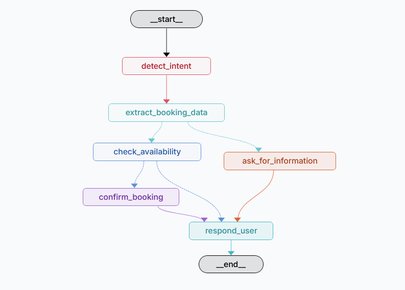
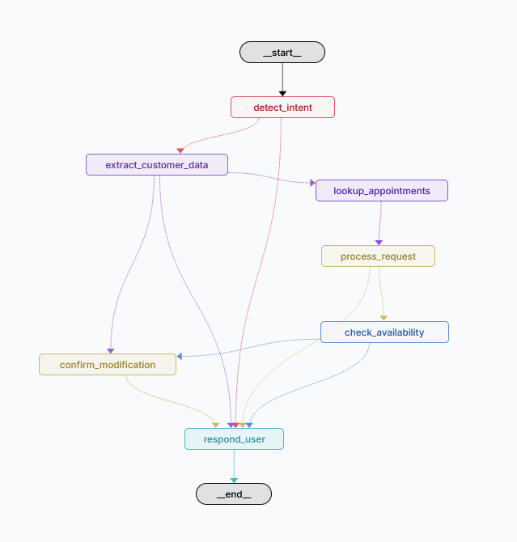

# Conversational LangGraph Patterns

Educational repository showcasing conversational patterns built with LangGraph. Each pattern demonstrates core concepts for building agentic conversational systems with practical, real-world examples.

Currently featuring two patterns:
- **Booking Pattern**: Guide users through booking appointments
- **Modify Appointment Pattern**: Help users modify or cancel existing appointments

## 📚 Available Patterns

### 1. Booking Pattern
A conversational agent that guides users through the process of booking an appointment. The agent asks for missing information, validates availability, and confirms bookings.

<div align="center">
  <a href="https://youtu.be/6p7aGX2jNCY" rel="nofollow">
    
  </a>
</div>

<div align="center">
  
</div>

- **Video Tutorial**: [Watch on YouTube](https://youtu.be/6p7aGX2jNCY)
- **Detailed Article**: [Read on Medium](https://medium.com/@juanluaiengineer/stop-building-unpredictable-ai-agents-for-booking-systems-62b18b405a1e?utm_source=github)
- **Code**: `patterns/booking/`

**Key Concepts:**
- Incremental information gathering
- Conditional routing based on state
- Availability validation
- Confirmation handling

### 2. Modify Appointment Pattern
A conversational agent that helps users modify or cancel existing appointments. The agent identifies the customer, looks up their appointments, processes modifications or cancellations, and validates availability for changes.

<div align="center">
  <a href="https://www.youtube.com/watch?v=l7e3HEotJHk" rel="nofollow">
    
  </a>
</div>

<div align="center">
  
</div>

- **Video Tutorial**: [Watch on YouTube](https://www.youtube.com/watch?v=l7e3HEotJHk)
- **Detailed Article**: [Read on Medium](https://medium.com/ai-in-plain-english/your-booking-chatbot-is-great-until-customers-want-to-change-something-8e4bffc9188f?utm_source=github)
- **Code**: `patterns/modify_appointment/`

**Key Concepts:**
- Customer identification and lookup
- Appointment selection from multiple results
- Modification request parsing (time, date, service)
- Availability validation for changes
- Confirmation handling for modifications
- Cancellation processing

## 🚀 Getting Started

### Prerequisites
- Python 3.10+
- pip

### Installation

1. Clone the repository:
```bash
git clone https://github.com/juanludataanalyst/langgraph-conversational-patterns.git
cd langgraph-conversational-patterns
```

2. Install dependencies:
```bash
pip install -r requirements.txt
```

3. Set up your environment (optional):
```bash
cp .env.example .env  # if you have an .env.example file
```

### Running the Patterns

#### Option 1: LangGraph Studio (Recommended)
View and test all patterns in an interactive web interface:

```bash
uv run langgraph dev
```

Then open `http://localhost:8000` in your browser. You'll see both patterns available to test.

#### Option 2: Test Locally
Run a specific pattern directly:

```bash
# Booking pattern
python patterns/booking/graph.py

# Modify Appointment pattern
python patterns/modify_appointment/graph.py
```

## 🤝 Contributing

We welcome contributions! Whether you want to:
- Add new conversational patterns
- Improve existing patterns
- Fix bugs
- Enhance documentation

Please read [CONTRIBUTING.md](CONTRIBUTING.md) for details on how to contribute.

## 📖 Learning Path

1. **Video**: Watch the tutorial to understand the pattern
2. **Code**: Explore the implementation in `patterns/<pattern-name>/`
3. **Article**: Read the detailed explanation on Medium
4. **Experiment**: Modify and extend the pattern

## 📁 Repository Structure

```
langgraph-conversational-patterns/
├── README.md                         # This file
├── CONTRIBUTING.md                   # How to contribute
├── LICENSE                           # MIT License
├── requirements.txt                  # Python dependencies
├── langgraph.json                    # LangGraph Studio configuration
├── img/                              # Visual assets
│   ├── BookingDiagram.PNG            # Booking pattern architecture
│   └── Modify_appointment_diagram.PNG # Modify appointment pattern architecture
└── patterns/
    ├── booking/                      # Booking pattern
    │   ├── __init__.py
    │   ├── state.py                  # State schema
    │   ├── nodes.py                  # Graph nodes
    │   └── graph.py                  # Graph definition
    └── modify_appointment/            # Modify/Cancel appointments pattern
        ├── __init__.py
        ├── state.py                  # State schema
        ├── nodes.py                  # Graph nodes
        └── graph.py                  # Graph definition
```

## 📝 License

This project is licensed under the MIT License - see the [LICENSE](LICENSE) file for details.

## 🙋 Questions?

If you have questions or suggestions, please open an issue on GitHub.

---

**Happy learning!** 🚀
